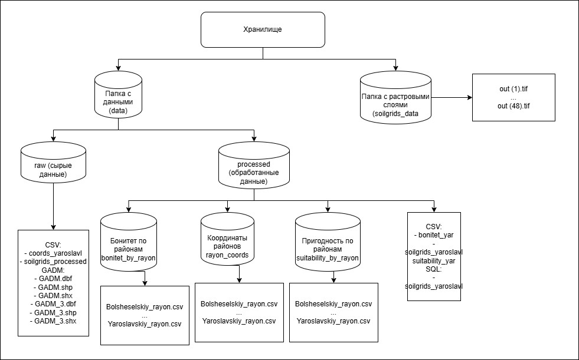
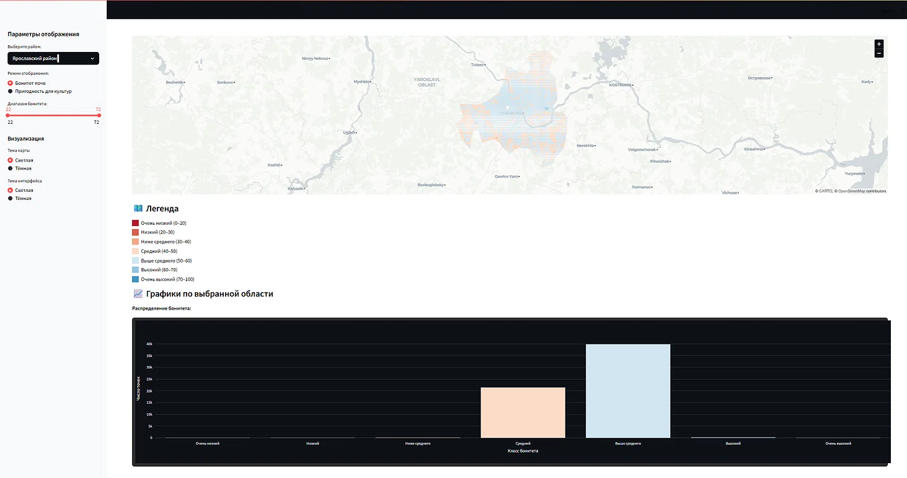
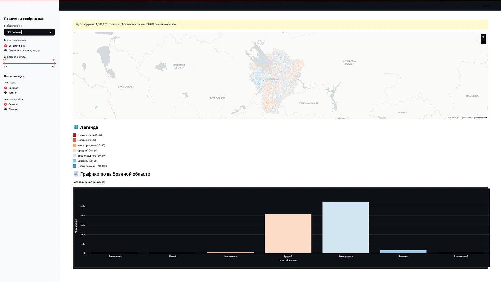
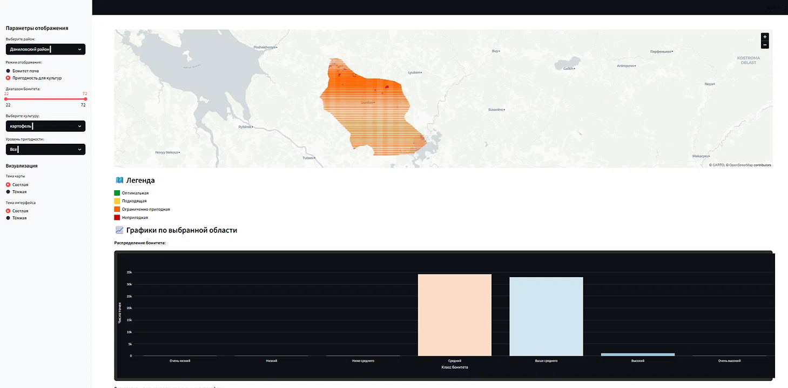

# Анализ бонитета почв Ярославской области

Курсовая работа по дисциплине «Проектный практикум».

## Задача

Требуется разработать информационную систему, которая рассчитывает
бонитет почв Ярославской области по данным открытых источников и
определяет пригодность земель для выращивания основных
сельскохозяйственных культур. Результат представляется в виде
интерактивной карты с возможностью фильтрации по диапазону бонитета
и уровню пригодности конкретной культуры.

## Исходные данные

Источник почвенных характеристик - международная база SoilGrids,
предоставляющая растровые данные о физических и химических свойствах
почв с разрешением 250 метров. Для Ярославской области используются
шесть блоков растров, каждый из которых содержит восемь слоёв:
содержание органического углерода, плотность, доля глины, песка и
пыли, ёмкость катионного обмена, кислотность.

Границы региона берутся из открытой базы GADM в формате shapefile.
Координатная сетка внутри полигона области генерируется с шагом
0.001 градуса.



## Методология

Бонитет рассчитывается как сумма баллов по шести агрохимическим и
агрофизическим показателям. Каждый показатель сравнивается с
эталонными диапазонами и получает вклад в общую оценку. Для
органического углерода максимальный вклад составляет 30 баллов, для
кислотности и гранулометрического состава - по 20, для ёмкости
катионного обмена - 15, для плотности - 10, для влагоёмкости - 5.
Итоговая сумма ограничена 100 баллами.

Дополнительно применяются зональные коэффициенты, учитывающие
особенности почвенного покрова разных частей области: суглинистых
и песчаных дерново-подзолистых почв, торфяников, серых лесных и
пойменных почв. Если хотя бы один из показателей выходит за пределы
допустимых значений, итоговый балл снижается на 20 процентов.

Пригодность земель для культуры оценивается по четырём-шести
параметрам в зависимости от вида растения: кислотности, содержанию
органического углерода, доле глины, минимальному бонитету и
дополнительным показателям, специфичным для культуры. Если все
условия выполняются, участок признаётся оптимальным. При невыполнении одного условия - подходящим, при невыполнении двух - ограниченно пригодным. В остальных случаях участок считается непригодным.

## Результаты

Средний бонитет по Ярославской области составил 52 балла, что
соответствует категории «выше среднего». Наибольшие площади
приходятся на дерново-подзолистые суглинистые почвы, наименьшие -
на торфяники, которые занимают ограниченные территории в северной
части области.

Пшеница и картофель оказались наиболее требовательными культурами:
для их возделывания пригодны преимущественно участки с бонитетом
выше 40–45 баллов. Рожь, овёс и лён демонстрируют большую
устойчивость к неблагоприятным условиям и могут возделываться на
более широком спектре почв.







## Запуск

Установите зависимости:

```
pip install -r requirements.txt
```

Запустите приложение:

```
streamlit run app/main.py
```

Откроется веб-интерфейс по адресу http://localhost:8501.

По умолчанию приложение ожидает полные файлы `data/processed/bonitet_yar.csv`
и `data/processed/suitability_yar.csv`. Если они отсутствуют, система
автоматически переключается на демонстрационные выборки из `data/sample/`,
содержащие по 1000 наблюдений. Этого достаточно для проверки
работоспособности интерфейса.

Для пользователей Windows предусмотрен файл `run-app.bat`, который
запускает приложение одной командой.

## Сборка и установка

Для распространения среди конечных пользователей предусмотрен
сценарий сборки установщика на основе Inno Setup. Готовый установщик
доступен в разделе
[Releases](https://github.com/dmitriev-yaroslav/soil-bonitet-yaroslavl/releases).
Файл сценария `bonitet_installer.iss` включён в репозиторий, сборка
выполняется командой `iscc bonitet_installer.iss`.

## Стек

Python, pandas, numpy, geopandas, rasterio, scikit-learn, pydeck,
streamlit, plotly.
